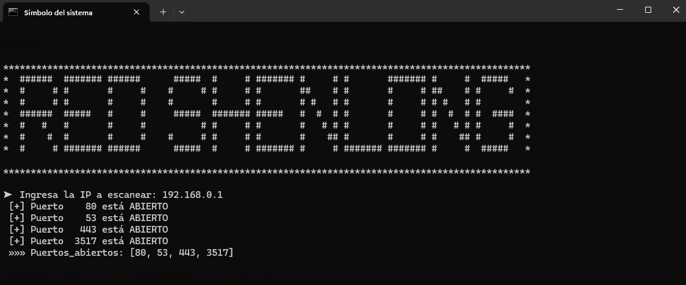

# RedShenlong: PyNet Scanner (High Performance)


Herramienta de reconocimiento de red desarrollada en Python para el estudio del protocolo TCP y el modelo OSI. Este proyecto implementa de forma nativa el **Three-Way Handshake** para detectar puertos abiertos en el rango completo (1-65535), optimizando el rendimiento mediante programación concurrente para obtener resultados en segundos sin depender de herramientas externas como Nmap.

## 📸 Demostración de Funcionamiento
El escáner utiliza un sistema multihilo para procesar miles de peticiones simultáneas, mostrando hallazgos en tiempo real y un resumen final ordenado.
  

---

## 🛠️ Características Principales
* **Escaneo Masivo:** Capacidad para analizar el espectro completo de puertos TCP (1-65535) en un tiempo mínimo.
* **Motor Multithreading:** Implementación de `ThreadPoolExecutor` con 500+ workers gestionados simultáneamente para maximizar el rendimiento de red.
* **Handshake Nativo:** Uso exclusivo de la librería `socket` y el método `connect_ex` para validar la apertura de puertos a nivel de capa de transporte.
* **Cierre Blindado:** Gestión de interrupciones mediante `os._exit(0)`, garantizando una detención inmediata y limpia de todos los hilos activos tras un `Ctrl+C`.
* **Resumen Inteligente:** Generación de una lista final de puertos abiertos, ordenada y formateada para facilitar su copia en otras herramientas de auditoría.

## 🚀 Guía de Uso

### 1. Clonar el Repositorio
No requiere librerías externas, ya que utiliza exclusivamente la biblioteca estándar de Python.

```
git clone [https://github.com/RedShenlong/PyNet-Scanner.git](https://github.com/RedShenlong/PyNet-Scanner.git)
cd PyNet-Scanner
```
### 2. Ejecutar la Herramienta
Funciona en cualquier sistema con Python 3 instalado (Windows, Linux o macOS).

```
python pynet_scanner.py
```
### 3. Parámetros
Al iniciar, el script solicitará la dirección IP o el dominio del objetivo.

Ejemplo: ➤ Ingresa la IP a escanear: 192.168.1.1

## ⚠️ DESCARGO DE RESPONSABILIDAD (DISCLAIMER)
**IMPORTANTE**: Este proyecto tiene fines estrictamente educativos y de investigación para la comprensión de protocolos de red. El uso de esta herramienta contra objetivos sin autorización previa es ilegal y puede tener consecuencias legales. El autor no se hace responsable del uso indebido de este código.
